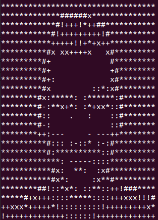

<table>
<tr>
<th> img_2ascii.py </th>
<th> Output </th>
</tr>
<tr>
<td>

```python
import cv2
img = cv2.resize(cv2.imread("alenic.jpg", 0), (34,24))
gray_chr = " .-:!*+x#@"
img_q = ((255-img)*((len(gray_chr)-1)/255)).astype(int)
print(*["".join([gray_chr[x]for x in y])for y in img_q], sep="\n")
```

</td>
<td>

</td>
</tr>
</table>


Hi 👋 I am Alessandro!

🧠 **Artificial Intelligence** is both my passion and profession.

While my primary specialization is in **Computer Vision**, I am also actively working in other areas such as **Natural Language Processing** and **Multimodal Learning**.

In my free time, I like experimenting with **Reinforcement Learning**.

I welcome and appreciate any feedback and contributions ❗️

🌐 [Linkedin - Alessandro Nicolosi](https://linkedin.com/in/alessandro-nicolosi/)
